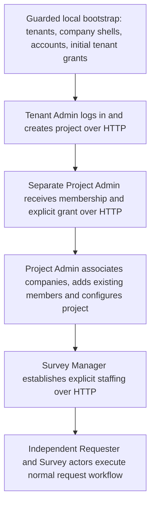

# DOT simulation

A quarantined, device-local synthetic-user proof of the real SWRTracker interfaces. No autonomous reasoning or model integration is included.

## Source and baseline

- Source: local `phase5` and `origin/phase5` at `6becd3bd541f58271e70cafd6a5da82162b44051`.
- Branch: `phase5-dot-sim`; sibling worktree: `D:\Programming\swrtracker-dot-sim`.
- Baseline Linux Dockerfile checks: `pnpm tsc --noEmit`, 544/544 `pnpm test` cases, production build and production dependency audit passed. Existing CSS/autoprefixer warnings remain.
- The original dirty RedTeam checkout's source changes were separately committed as `5064cb7`. They are not the simulation baseline. Its pnpm commands aborted during dependency reconciliation before executing; this does not describe the isolated Linux baseline.
- Sources: [CLAUDE.md](CLAUDE.md), [AGENTS.md](AGENTS.md), [approved requirements](REQUIREMENTS_ADCQ-260923-001.md), Decision 34/36 in [the decision log](worklogs/LEAD_DECISION_LOG.md), CODEX Batches 98–100, current routes/use cases/repositories/tests and migrations 001–032. [Sabine](SABINE_SIMULATION.md) supplied launcher patterns only.

## Boundary and identities



**FACT:** Initial tenant creation is closed; current registration requires a bound invite. At the original phase5 baseline, invitations created only subcontractor Requesters. The owner subsequently approved the scoped employee invitation increment documented below. The original retained fixture bootstrap inserts two unmistakably fictional tenants, four company shells and 15 account shells, with no project, project membership, Project Admin grant, staffing, request, audit-transition or outbox fixtures. Only the primary Central IT account and the foreign tenant denial-control account receive initial TENANT_ADMIN grants. The initial disabled account is a negative control, not a simulated offboarding action. Infrastructure ownership has its own `_dot_sim_runtime` marker; it is not a production migration or application audit event.

Primary working roles: one Central IT, a separate Project Admin candidate, one Survey Manager, one Superintendent, two Party Chiefs, four Instrument Men and several Requesters. GC field accounts start without project access and enter as Requesters before Manager staffing assigns their fixed field roles. An OWNER_REP account exercises eligible Project Admin grant/revoke. The subcontractor Requester is created through a real Project Admin invitation and normal registration on the first smoke run. Subsequent runs add that existing account normally. A disabled account and a foreign tenant Central IT account serve only denial checks; this is not a second operational simulation.

Every email ends in `@dot-sim.example.invalid`; names start with `DOT SIM`. Every password is separately generated. Account shells are dormant in the sense of having no project access, not globally disabled accounts. All behavioral mutations use HTTP. The actor module has no database, repository, domain-service or ticket-use-case imports. A separate bootstrap process and read-only evidence collector use the dedicated database; actors never receive its URL or credentials.

## Commands and isolation

Run from this worktree with Node and local Docker Desktop available:

```powershell
node scripts/dot-runtime.mjs setup
node scripts/dot-runtime.mjs start
node scripts/dot-runtime.mjs status
node scripts/dot-runtime.mjs smoke
node scripts/dot-runtime.mjs stop
```

Setup builds dedicated `swrtracker:dot-sim` and `swrtracker:dot-sim-checks` images using the production Dockerfile. The Dockerfile runs TypeScript, the entire test suite and production build. Bootstrap claims a positively empty database before migrations, then applies existing migrations and inserts only initial identities atomically. Rerunning setup preserves all accounts, passwords and prior activity; it is not a reset. Smoke creates a new small project/request and negative-control projects each run, retaining results for diagnosis. It logs actors out on successful completion; failure may leave that run's in-memory sessions valid until expiry, but no cookie is persisted.

| Resource | Exclusive dot allocation |
|---|---|
| PostgreSQL | `swrtracker-dot-sim-db`, database `swr_dot_simulation`, no published host port |
| Web | `swrtracker-dot-sim-web`, `http://127.0.0.1:3118` only |
| Network | `swrtracker-dot-sim-network`, dedicated bridge with outbound IP masquerading disabled |
| Database volume | `swrtracker-dot-sim-postgres` |
| Attachment volume | `swrtracker-dot-sim-attachments` |
| Private host files | `.data/dot-sim/` (already Git-ignored and excluded from Docker builds) |

Containers, network and volumes require both `swrtracker.simulation=dot-sim` and a generated `swrtracker.dot.owner` UUID. The launcher validates network membership, volume mounts/local driver, database identity/ownership marker, settings and loopback port before operating. It refuses unknown resources or lost ownership credentials. Remote Docker sockets, redirected local data paths and concurrent launcher commands are refused. An interrupted command can leave `launcher.lock`; inspect its recorded PID before deliberately removing that one local lock. No arbitrary DATABASE_URL, JWT or email configuration is inherited. No worker or external integration is started, and Next telemetry is disabled in the running app. The bridge is not a general host firewall contract; no hosted endpoint is part of this harness. Docker administrators remain trusted.

`runtime.json` contains generated infrastructure secrets; `credentials.json` contains individual fictional passwords and IDs. Both stay beneath `.data/dot-sim/`. `ACCESS.md` gives the URL/tenant and points to the private credentials file. Windows ACLs restrict the directory/files to the current OS user; Linux uses 0700/0600. Secrets are provided at container creation or through a read-only bootstrap mount, never image layers. Do not publish this directory or Docker inspect output.

There is no database/volume reset command. Stop retains all data. After rebuilding, start/smoke refuse a stale app container. To replace **only the owned web container**, retaining all volumes:

```powershell
$env:SWR_DOT_RECREATE_WEB = '1'
node scripts/dot-runtime.mjs recreate-web
Remove-Item Env:SWR_DOT_RECREATE_WEB
node scripts/dot-runtime.mjs start
```

## Project Admin investigation

**FACT:** Current phase5 has a `ProjectAdministration` component on `/projects/<id>/admin`, with “Add a project member”, separate company association and separate administrator assignment controls. `POST /members` → current `assertProjectAdministrator` → `addProjectMember` → `TenancyRepository.saveMembership` permits Central IT or an eligible current local admin. The TENANT_ADMIN-only route comment and older test titles are stale; executable code and the current approved parity increment govern behavior.

| Capability/prerequisite | Current result, reproduced through HTTP |
|---|---|
| List members | Central IT, current Project Admin and actual Survey Manager may list; ordinary users denied |
| Associate companies | Current Project Admin may associate/register a same-tenant company only within an administered project |
| Add existing account | User must exist in the tenant and be active; local admin requires company-to-project association first |
| Missing association | User is absent from UI candidate response; local POST returns 403; association makes the candidate visible and addition succeeds |
| Supported member roles | REQUESTER, SURVEY_MANAGER, SURVEY_SUPERINTENDENT, PARTY_CHIEF, INSTRUMENT_MAN, CAD_TECHNICIAN, CAD_LEAD, VIEWER |
| Project Admin grant/removal | Separate `/administrators` command preserves operational role; only active GC/OWNER_REP project members qualify; subcontractor grant returns 404 |
| Subcontractor role | Requester only; operational escalation returns 403 |
| Existing membership | Insert-only route returns 409, never overwrites role/access; fixed survey changes use the existing Manager staffing workflow |
| Disabled account | Login returns 401 and new membership returns 409 |
| Session renewal | Membership/admin-grant writes increment target session version; an old cookie returns 401 until normal sign-in renewal |
| Project state | Member/company/admin writes refuse ARCHIVED; AOR structural setup is SETUP-only; Project Admin may activate after readiness succeeds |
| Creation boundaries | New project remains Tenant Admin-only. This selector adds existing accounts; the adjacent invitation section now onboards a new Requester |

**FACT:** The owner clarified the original symptom: Jordan Lee saw no visible way to create a member. Current code offers addition of an existing account, with company-bound candidate discovery, and, at the source baseline, only subcontractor invitation registration. The smoke reproduces an empty candidate result for an unassociated company and its 403 mutation denial, then the successful approved path. No authorization change was needed to add existing accounts. The owner subsequently approved the distinct new-employee invitation increment below.

**INFERENCE:** If “create a member” meant create a new GC/Survey account, the source baseline lacked that onboarding flow; the owner approved the narrow invitation increment below. If it meant add an existing account, company association, current grants, renewed session and deployed UI version are the concrete checks.

**UNKNOWN:** Jordan's original runtime/build, actual grant, selected project and candidate-company data were not supplied or captured. The exact original screen was not reproduced; no claim is made that its cause was definitively proven. Incumbent Sabine/rehearsal data was not inspected or reused. Future actors must satisfy the verified current prerequisites rather than obtain expanded permissions.

## Deterministic proof and evidence

The smoke uses independent actors to create/configure a FULL project, establish a pure Project Admin with Requester operational membership, associate companies, add members, exercise eligible administrator grants and real subcontractor registration, create an Area, assign Superintendent coverage, and staff two explicit Chief/two-IM crews through the Manager snapshot command. Project Admin activates with acknowledged current soft readiness warnings (department, acting designee, allowed domain); none is fabricated to bypass the gate.

The Requester creates and explicitly saves one draft, submits, Survey Manager approves, Superintendent assigns a Chief/IM, and the assigned IM starts/completes directly under the approved current workflow. The requester reads Completed. Create/approval retries produce one request/event; changed create intent with the same key is rejected. Ordinary user, pure Project Admin, unrelated project, foreign tenant, subcontractor, disabled account, stale session and logged-out session checks receive the expected 400/401/403/404/409 responses. Tenant Admin without operational membership cannot approve work.

Local files: `trace-<runId>.jsonl`, `last-run.json`, `evidence.json`, and private build logs. Trace fields include run/actor identity, declared simulation role, latest observed project capabilities when requested, action, time, valid project/request IDs, status/result and generated correlation/retry IDs. Declared role metadata never decides authorization. Passwords, invite tokens, cookies, JWTs, infrastructure secrets, response bodies and attachment bytes are excluded. Database evidence reconciles actual role holders, grants, transition actors/counts, administrative and staffing events. Application audit tables remain authoritative.

**ESTABLISHED:** Repeated live HTTP runs completed, including persisted identity reuse. Final run `ef5d1f15-0590-4757-a3de-7e807fac5c8e` completed request `cef65730-0738-48aa-b5b3-3b9fe0b88661`, with 27 explicit expected denials and authoritative event/actor reconciliation. Final TypeScript checks, 553/553 tests and production build passed; the production audit gate passed. The dot containers were then stopped, retaining their owned volumes and local evidence. Baseline 544 tests passed. Details are recorded in the CODEX entry and private build logs. This is HTTP/application acceptance, not browser interaction, all actions, concurrency/load testing, crash recovery or a production release. Attachments have separate persistent storage but upload/download is outside this scenario.

## Future dot adapter and deferred work

Give a future agent exactly one `DotActor` instance from `scripts/dot-sim/actors.mjs`. It calls `login()`, `act(action,input,{key})` and `logout()` and observes only that actor's returned HTTP payloads. Use `Object.keys(actions)` for implemented actions. Keep one UUID key and frozen input for a deliberate retry of a supported idempotent mutation; authorization failure stays with the same actor. The adapter never automatically retries. Project creation, invitation, structural setup and activation do not currently promise idempotent replay: reconcile an uncertain result through normal reads before another attempt. Do not access runtime settings, other actor credentials or the evidence collector from the agent.

The next step is a bounded controller selecting **one existing action for one actor** through this interface, with input/result validation and a step budget, against this proven local runtime. Adding models requires a separate decision because this runtime currently has no model transport and no external endpoint. Add further adapters only by mapping existing application routes.

Deferred: LLM integration/reasoning/planning, personalities, stochastic behavior, long-running populations, load tests, analytics/telemetry features, customer data, proprietary material generation, cross-tenant operational simulation, production deployment, account-model/permission expansion, complete reproduction of Jordan's original session, remaining invitation UI states/mobile acceptance, attachment acceptance and additional workflow actions.

## Approved new employee/requester invitation increment (2026-10-02)

The owner approved project-scoped employee onboarding after reviewing the missing Terry Smith example. Project Admin or Central IT selects a company and email, reviews the fixed Requester scope, confirms, and creates a registration link. GC and Owner Rep require explicit project-company association; the existing subcontractor association/retained-membership path remains valid. The recipient chooses their own name/password through the existing company/project/email-bound, expiring, one-use registration. Existing tenant accounts use member addition instead; invitations never overwrite or reactivate them. Pending duplicates conflict. Archived projects reject issuance, successful-command replay and registration. No tenant role, other project, general role picker or administrator-selected password is added.

Invitations now share the project administration command owner and stable idempotency key. Current session/authority/project state is checked before replay. Invitation and administrative audit append are atomic; invitation tokens remain absent from audit/traces and appear only in the local invitation response and protected command ledger. The old duplicate subcontractor invitation form is consolidated here; subcontractor company-wide view grants remain separately scoped and unchanged. No external email transport was added.

Additional command:

~~~powershell
node scripts/dot-runtime.mjs smoke-invitations
~~~

It executes a fresh normal HTTP lifecycle proof and receives that newly created project's ID directly in memory. It then invites and independently registers three fictional Requesters (GC Terry Smith, Owner Rep and subcontractor), verifies current authority/company/project/tenant/registration/retry boundaries, and archives only that same newly created proof project through the normal API. It never selects a retained archive target from last-run.json. Initial fixtures and all earlier projects remain preserved. Each run adds three new fictional accounts through registration; extra passwords stay in .data/dot-sim/invitation-credentials-<runId>.json. Trace/report are invitation-trace-<runId>.jsonl and last-invitation-run.json; the authoritative collector reads identities/invitations/events without token values. Normal smoke continues to verify the original lifecycle and allows these additional explicitly synthetic accounts.

The original seeded staff fixture remains retained; newly onboarded Requesters need no bootstrap SQL. A future fresh-fixture reduction can move more actor creation to invitations without changing the actor session boundary. Broader account/role management remains outside this approved increment.

User screenshots now establish the Admin tab, existing-member selector and the new invitation desktop success state. Independent source/desktop-slice review found no material defect. Browser automation was rejected by browser security policy; no workaround was used. Mobile, confirmation context, recipient screens and visual focus/retry acceptance remain pending; HTTP results do not establish those rendered states. Final automated acceptance is recorded in CODEX.
